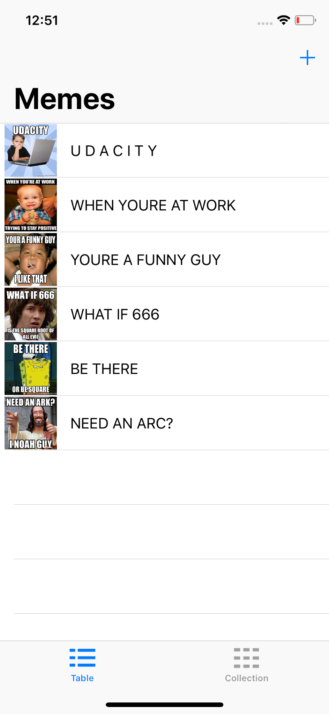
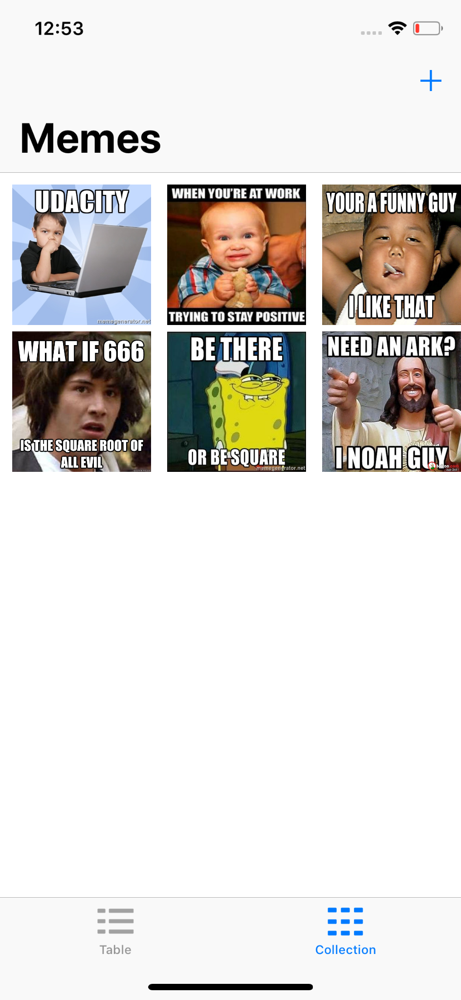
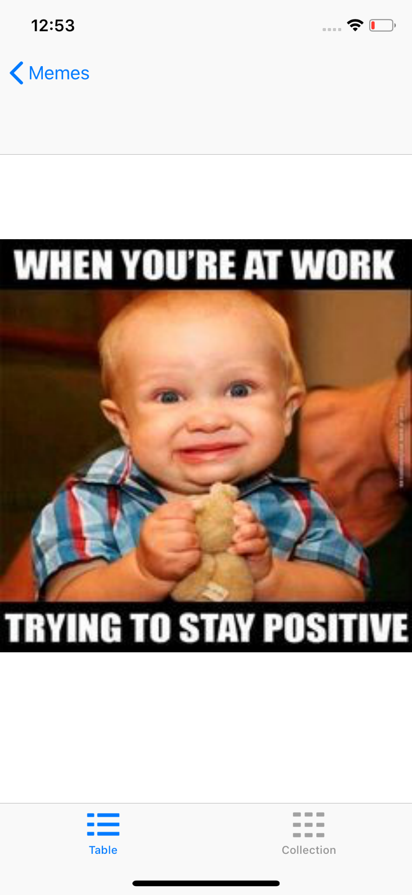

<p align="center">
  
</p>

<a href="https://developer.apple.com/swift/" target="_blank">
  
</a>

<a href="https://www.udacity.com/course/ios-developer-nanodegree--nd003" target="_blank">
  
</a>  

# MemeMe 

With MemeMe you can create multiple persistent memes using your fotos from your iPhone media library or take one from your camera directly.
This App is the Final Project for UIKit Course from <a href="https://www.udacity.com/course/ios-developer-nanodegree--nd003" target="_blank"> Udacity </a>.

## Screenshots

 

 


## Buzzwords

* UIKit
* UIViewController
* UITableViewController
* UICollectionViewController
* Segues
* Repository Pattern
* MVC

## Folder Structure


## Instalation

```bash
git clone https://github.com/andremartingo/udacity-iOS-meme.git
open MemeMe.xcodeproj
```
